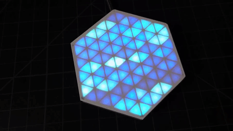
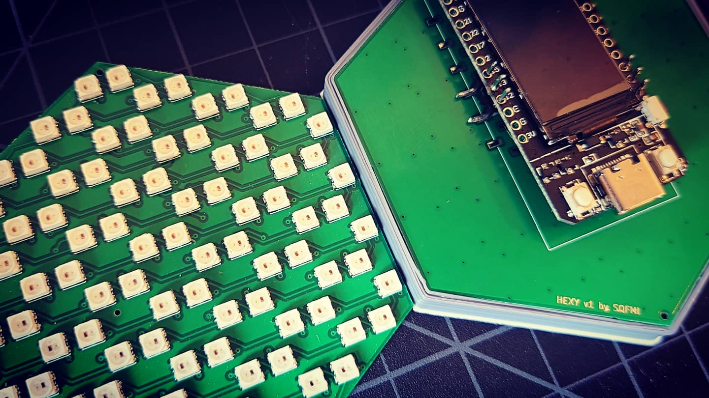
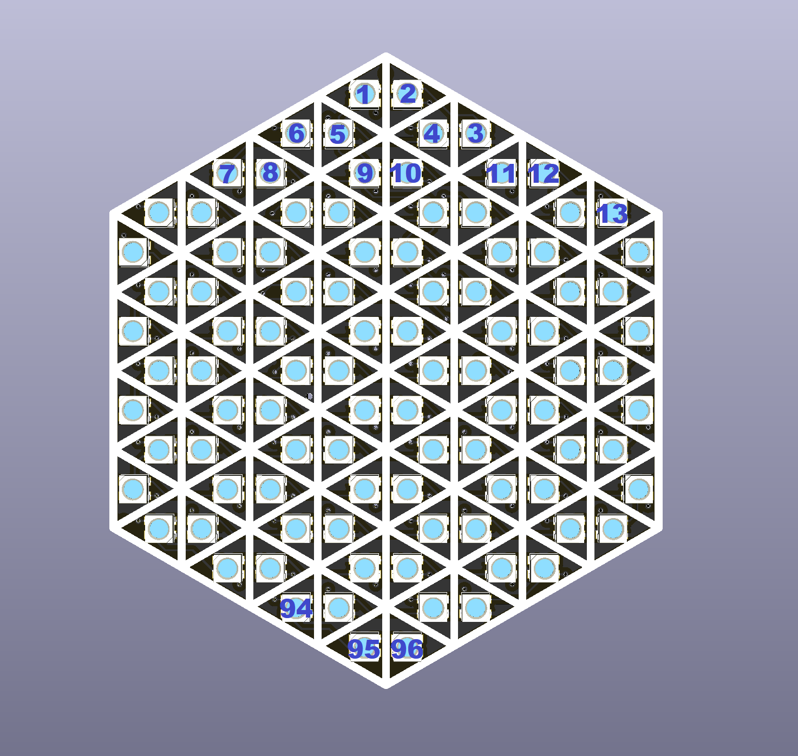

# Hexy

Inspired by [Mukesh Sankhla](https://www.youtube.com/c/MukeshSankhla)'s [HexMatrix](https://hackaday.io/project/173732-rgb-hexmatrix-iot-clock) project, this is a smaller version using 96 3.5x3.5mm RGB LEDs ([WS2812B-MINI](https://www.adafruit.com/product/2659))

## Hardware
All KiCad design files under MIT license

### BOM
- 1 x PCB
- 96 x [WS2812B-MINI](https://www.adafruit.com/product/2659)
- 1 x [TTGO T-DISPLAY](https://www.aliexpress.com/item/33048962331.html) (or any other microcontroller)

### Wiring Pattern
The LEDs are laid out in a zigzag pattern:

## Software
We used the [FastLED](https://github.com/FastLED/FastLED) library v3.3
- Set the data pin to **13** (or any other pin if you are using another microcontroller)
- Set the number of LEDs to **96**
- Set the LED Chipset to **WS2812B**

## Frame
For best visual results, 3D print the seperator grid [hexy-frame.stl](hexy-frame.stl) to keep the light from bleeding over. You will also need a piece of paper/acrylic glued on top to diffuse the light so each triangle cell looks nice and crisp [hexy-diffusion.dxf](hexy-diffusion.dxf)
